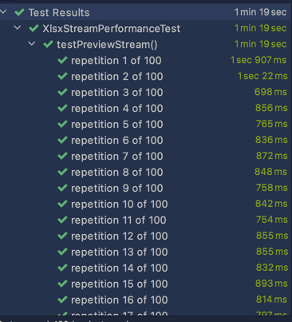
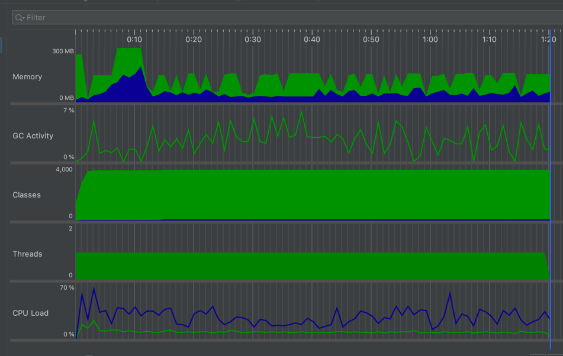
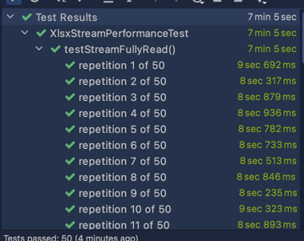
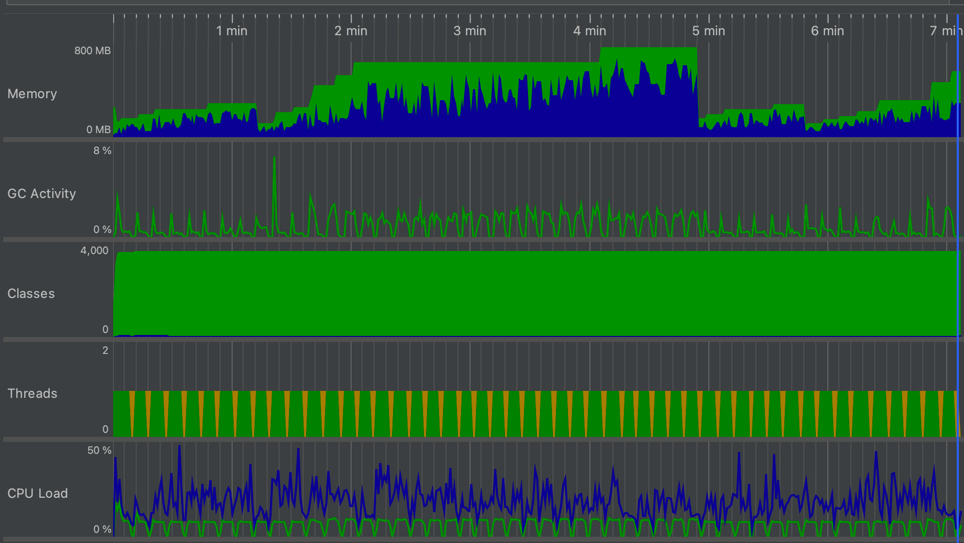
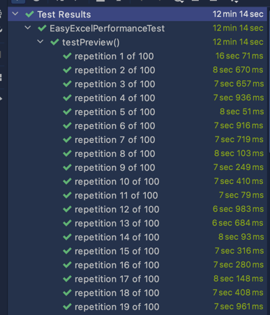
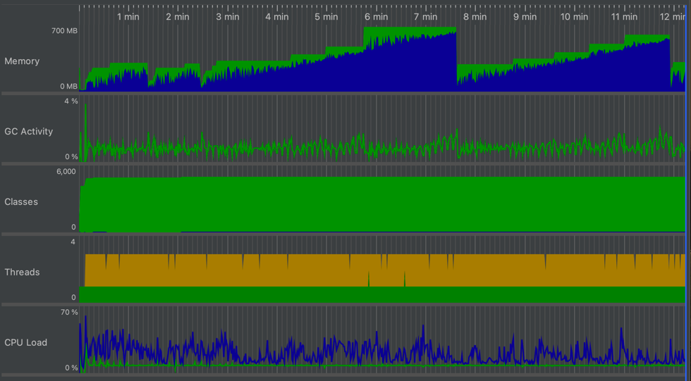
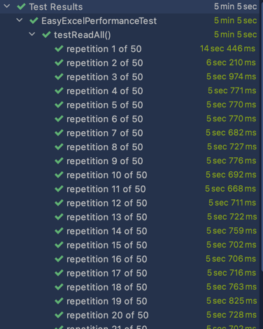
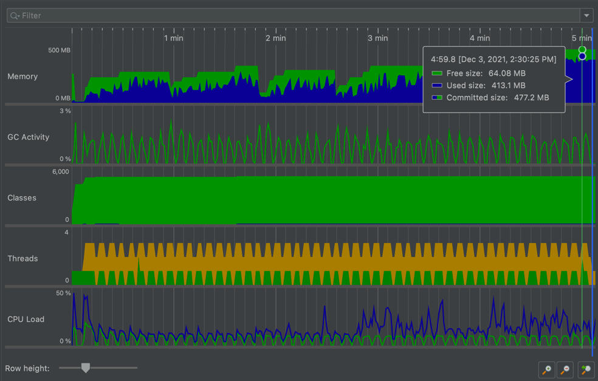

# Performance Test

## Machine Info

1. MacBook Pro
2. CPU: 6-Core Intel Core i7
3. Mem: 16 GB
4. Java version: JDK 12

## JVM env var

-XX:MinHeapFreeRatio=20

-XX:MaxHeapFreeRatio=30

-XX:G1PeriodicGCSystemLoadThreshold=2.0

-XX:G1PeriodicGCInterval=600000

## File Info

1. File size: 41 MB
2. File format: xlsx
3. Sheet number: 3
4. Row size: 290000

## Preview 20 rows

1. Time

* Run 100 times，avg time = 79s / 100 =  **790 ms**

2. Resource Consumption

* Memory peak is at about 195 MB
* CPU load peak is about **24%** and at most time is lower than **10%**;
* GC activity is lower than 7%;

## Fully Read

1. Time

* Run 50 times, sleeping 2 seconds after each running，average time =  (425 - 2 * 49) / 50 = **6.54 s**

2. Resource consumptions

* Memory peak is at about **684 MB**;
* Memory usage climbing with service running. After running for a while, Plenty of resources have been recycled and back to the
  status when service started;
* CPU is stable, **below 10%**;
* GC activity is always below 8%;

# Compared with another open source lib

## EasyExcel

### Preview 20 lines

1. Time

* Run 100 times, average time = 734 / 100 = **7.34 seconds**

2. Resource consumptions

* Memory peak is at about **638 MB**;
* Memory usage climbing with service running. After running for a while, Plenty of resources have been recycled and back to the
  status when service started;
* CPU is stable, **below 4%**;
* CPU load peak is about **32%** and at most time is lower than **10%;**

### Fully Read

1. Time

* Run 50 times, sleeping 2 seconds after each running，average time = (305 - 2 * 49) / 50 = **4.14 seconds**

2. Resource consumptions

* Memory peak is at about **413 MB**;
* Memory usage climbing with service running. After running for a while, Plenty of resources have been recycled and back to the
  status when service started;
* CPU is stable, **below 3%**;
* CPU is stable, lower than **10%**;

## Conclusion

1. For preview, EasyExcel is apparently worse；
2. For fully read, EasyExcel is a little better；